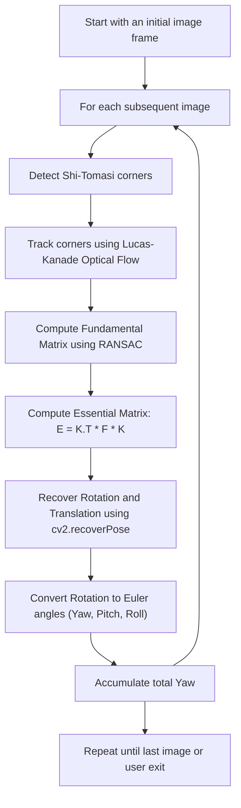

# ROV_PoseTracker


# Optical Flow-Based Visual Odometry with Yaw Estimation

This project estimates **relative yaw (rotation around the vertical axis)** from a sequence of monocular images using **optical flow**, **fundamental matrix estimation**, and **essential matrix decomposition**.

It is designed for image sequences captured from a RealSense camera, and makes use of the camera's intrinsic parameters to recover motion information.

---

## 🔍 Features

- Detects and tracks **feature points** using Shi-Tomasi + Lucas-Kanade Optical Flow
- Computes **relative rotation** between frames via:
  - Fundamental matrix
  - Essential matrix
  - Pose recovery (`cv2.recoverPose`)
- Converts rotation matrix to **Euler angles** (yaw, pitch, roll)
- Accumulates **total yaw** over time
- Visual debug logs for motion tracking and pose recovery

---

## 📦 Dependencies

- OpenCV (`cv2`)
- NumPy

```bash
pip install opencv-python numpy
```

---

## 🧠 Main Logic Explained



---

## 📸 Camera Parameters

Camera matrix (Intrinsic parameters) used:

```
K = [[675.54,   0.00, 311.19],
     [  0.00, 677.85, 221.61],
     [  0.00,   0.00,   1.00]]
```

---

## 🛠️ Code Overview

| Section                         | Purpose                                                                 |
|----------------------------------|-------------------------------------------------------------------------|
| `rotational_to_euler(R)`        | Converts a 3x3 rotation matrix to yaw-pitch-roll angles                 |
| Shi-Tomasi + LK Flow            | Detects and tracks feature points across frames                        |
| Fundamental Matrix (`cv2.findFundamentalMat`) | Estimates relative geometry between image frames               |
| Essential Matrix                | Encodes rotation + translation using camera intrinsics                 |
| Pose Recovery (`cv2.recoverPose`) | Extracts rotation matrix from Essential matrix                        |
| Yaw Accumulation                | Adds yaw from each pair of frames to compute net rotation              |

---

## 🚀 Usage

Make sure to update the image path and filenames appropriately:
```python
img_path1 = "../imgdatapool/img" + str(index) + ".jpg"
```

Ensure you have a sequence of images named consistently like `img2497.jpg`, `img2498.jpg`, ..., `img2592.jpg`.

Then simply run the script:
```bash
python yaw_estimation.py
```

Press `ESC` to interrupt at any time.

---

## 📈 Output

- Yaw angle per frame is printed
- Total accumulated yaw (in degrees) is displayed at the end

---

## 🧩 Notes

- Optical Flow fails gracefully: if points are lost or corrupted, new ones are re-detected
- Pose is computed only when enough good points are tracked
- Currently handles **only yaw estimation**, but can be extended to full pose tracking

---

## 📎 TODOs

- Add visualization overlay of tracked points
- Integrate IMU for better fusion
- Handle scaling ambiguity for monocular depth

---

## 📄 License

MIT License. Free to use and modify.